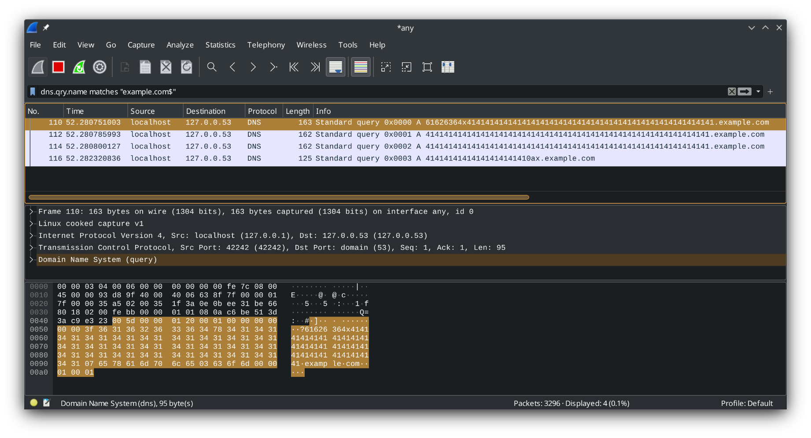

Ondřej Mach (xmacho12)  

# Tunelování datových přenosů přes DNS dotazy

## Návrh

Největší otázkou návrhu bylo kódování souboru při přenosu.
Doménové jméno smí obsahovat pouze písmena (veklká i malá) čísla a pomlčku.
Přenášený soubor může obsahovat jakékoli hodnoty bajtů.
Proto je nutné použít kódování.

Na první pohled se nabízí kódování `base64`, bohužel toto kódování má ve své sadě znaků i `+`, `/` a `=`.
Pro řešení bylo zvoleno kódování bajtů na hexadecimální zápis.
Toto značně sníží efektivitu, na druhou stranu je implementace velmi snadná, protože z jednoho vstupního bajtu se stanou přesně 2 výstupní.

Dalším problémem bylo, že nepřenášíme pouze obsah souboru, ale i jeho jméno. 
Toto bylo vyřešeno delimiterem, který oddeluje jméno a obsah souboru. 
Tento delimiter je odeslán i na konci obsahu, aby signalizoval konec přenosu. 
Jako delimiter byl zvolen znak `x`, bez konkrétního důvodu.

Pokud bychom tedy odesílali soubor `AAA`, jehož obsah by byl `BBB`,
výsledný kód by vypadal takto.

```
414141x424242x
```

Dále je třeba vyřešit, jakým způsobem rozdělit zakódovaný soubor do DNS paketů.
Je bráno v úvahu, že soubor může být libovolné velikosti a bude poslán ve více paketech.
DNS se běžně posílá přes UDP pakety.
UDP ale není spolehlivé, proto by bylo nutné implementovat vlastní mechnismy na ošetření. 
UDP také nezaručuje, že odeslané pakety přijdou ve stejném pořadí. 
Kvůli těmto problémům byla zvolena implementace přes TCP, která není tak častá, ale všechny servery by ji měly podporovat. 

Jeden DNS paket může nést mnoho záznamů ve 4 sekcích (dotazy, odpovědi, autoritativní sekce, dodatečná sekce).
Pro jednoduchost bude tato implementace odesílat v jednom paketu pouze jeden záznam, který bude v sekci s dotazy.
Odsud plyne omezení na množství přenesených dat v jednom dotazu.
Doména se skládá z více částí (anglicky labels) oddělených tečkou. 
Jedna tato část má maximální délku 63 znaků, celá doména může být dlouhá až 255 znaků.
V této implementaci obsahuje doména pouze jednu část (label) se zakódovanými znaky, kterou následuje `BASE_HOST` zadaný jako argument.

Ve výsledku tak jeden paket DNS přenese až 31 bajtů výsledného souboru.
 
## Implementace komponentu sender


## Implementace komponentu receiver

Server běží na cílovém počítači jako root, proto je důležité dbát i na bezpečnostní opatření.
Bez kontroly jmen souborů, která přichází od klienta by mohlo dojít k tzv. path traversal.
To znamená, že pokud by klient poslal jméno souboru např. `../file.txt` soubor by se uložil mimo původní složku.
Toto je velmi nebezpečné, obzvlášť za roota, který může přepsat jakýkoli soubor v systému.
Implementace receiveru předchází této zranitelnosti tak, že nepovolí žádný znak lomítka ve jméně souboru.

## Testování

Projekt byl testován lokálně.
Pro přenos souboru je třeba nejprve spustit server.
Server musí být spuštěn jako root protože komunikuje na portu 53.
Tento port patří mezi tzv. well-known porty, které jsou definovány jako rozsah od 1 do 1023.

```
$ ./dns_receiver example.com files
Listening for new connections...
```

`example.com` je koncem domén, ve kterých budou přenášena data. 
`files` je jméno složky, do které budou ukládány přijaté soubory.

Pro sledování paketů je také vhodné zapnout nástroj Wireshark.
Pro tento případ bylo nastaveno rozhraní na `any` a filtr na `dns.qry.name matches "example.com$"`.


